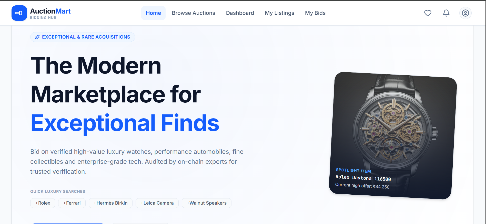
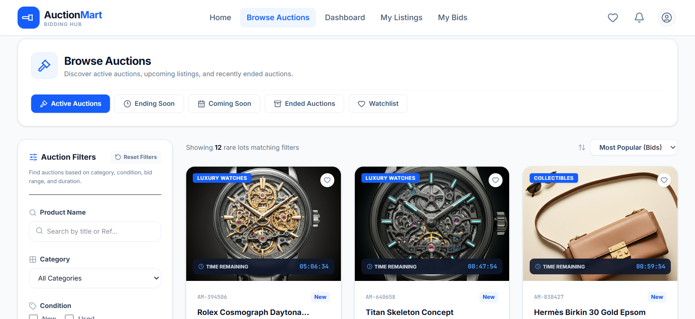
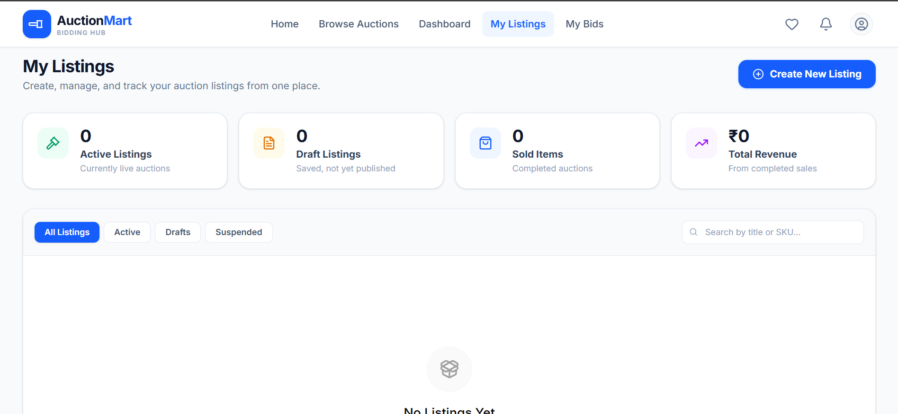

## 📖 Project Description

**AuctionMart** is a modern, full-stack online auction marketplace. It provides a platform for users to list items for auction, place bids in real-time, and manage their auction activities. Built with a robust tech stack, AuctionMart ensures a seamless, secure, and responsive experience for both buyers and sellers. 

The platform supports multiple product image uploads, secure authentication, real-time bid tracking, watchlists, and instant notifications, all backed by a scalable PostgreSQL database and Supabase Storage.

---

## 🚀 Features

- **User Authentication:** Secure registration and login using JWT.
- **Auction Listings:** Browse active, upcoming, and past auction listings.
- **Create Auctions:** Sellers can effortlessly create auction listings with detailed descriptions.
- **Multiple Image Uploads:** Seamlessly upload multiple product images per listing.
- **Bidding System:** Users can place competitive bids on active auctions.
- **Seller Dashboard:** Sellers can view and manage their own listings.
- **Watchlist:** Add items to a personalized watchlist to track favorite auctions.
- **Notifications:** Receive alerts for bid updates, auction wins, and watchlist activities.
- **Feedback System:** Submit and view feedback for completed transactions.
- **Product Details:** Comprehensive product view including current bids, remaining time, and image galleries.

---

## 💻 Tech Stack

### Frontend
- **React** - UI Library
- **TypeScript** - Static Typing
- **Vite** - Build Tool
- **React Router** - Navigation
- **Context API** - State Management
- **Tailwind CSS** - Styling

### Backend
- **Node.js** - JavaScript Runtime
- **Express.js** - Web Framework
- **PostgreSQL (Supabase)** - Relational Database
- **Supabase Storage** - Object Storage
- **Multer** - File Upload Middleware
- **JWT** - Authentication
- **CORS** - Cross-Origin Resource Sharing

### Database & Cloud
- **Supabase PostgreSQL** - Managed Database
- **Supabase Storage** (`product-images` bucket) - Media Storage

### Deployment
- **Frontend** → Vercel
- **Backend** → Render

---

## 🏛️ System Architecture

AuctionMart is built on a clean, layered architecture ensuring scalability, maintainability, and clear separation of concerns.

- **User / Browser:** The client interacting with the React application.
- **React Frontend:** Handles UI presentation, state management, and user interactions. Hosted on Vercel.
- **Express REST API:** The backend server that processes business logic, handles authentication, and acts as a bridge between the frontend and the database. Hosted on Render.
- **Supabase PostgreSQL:** The primary relational database storing all structured data (users, bids, auctions).
- **Supabase Storage:** A dedicated object storage bucket (`product-images`) for securely storing uploaded product images and serving them via public URLs.

---

## 🗂️ Folder Structure

```text
AuctionMart/
├── Frontend/
│   ├── public/
│   ├── src/
│   │   ├── assets/
│   │   ├── components/
│   │   ├── context/
│   │   ├── modules/
│   │   ├── pages/
│   │   ├── services/
│   │   ├── App.tsx
│   │   └── main.tsx
│   ├── package.json
│   ├── vite.config.ts
│   └── tailwind.config.js
│
└── Backend/
    ├── controllers/
    ├── middleware/
    ├── routes/
    ├── db.js
    ├── server.js
    ├── package.json
    └── .env
```

---

## 🛠️ Installation

### Prerequisites
- Node.js (v16 or higher)
- npm or yarn
- A Supabase project (for PostgreSQL and Storage)


## ☁️ Deployment

AuctionMart is designed for modern cloud deployment.

- **Frontend Hosting:** [Vercel](https://vercel.com/) - Provides seamless CI/CD for our Vite React application.
- **Backend API Hosting:** [Render](https://render.com/) - Hosts our Node.js Express server.
- **Database & Storage:** [Supabase](https://supabase.com/) - Provides managed PostgreSQL and object storage.

**Deployment Architecture:**
Users access the Vercel-hosted frontend, which communicates securely with the Render-hosted backend API. The backend securely interacts with Supabase for data persistence and image storage.

---

## 🔌 API Endpoints

| Method | Endpoint | Description |
| :--- | :--- | :--- |
| **POST** | `/api/auction/create` | Create a new auction listing (requires Auth & multipart/form-data) |
| **GET** | `/api/auction/all` | Fetch all active auctions |
| **GET** | `/api/auction/:id` | Fetch specific auction details |
| **GET** | `/api/auction/user/:email` | Fetch all auctions created by a specific user |
| **DELETE**| `/api/auction/:id` | Delete an auction listing |
| **POST** | `/api/bids` | Place a new bid on an auction |
| **GET** | `/api/bids/:auctionId` | Get all bids for a specific auction |
| **POST** | `/api/feedback` | Submit feedback for a completed auction |
| **POST** | `/api/watchlist` | Add or remove an item from the user's watchlist |
| **GET** | `/api/notification` | Fetch user notifications |

*(Note: Routes are prefixed with your configured API base path, e.g., `/api`)*

---

## 🗄️ Database Schema Overview

The robust data layer is powered by PostgreSQL. Here are the core tables:

- **`auction_lots`**: Stores all details regarding auction listings (title, description, starting price, end date, status) along with the public URLs to the uploaded product images.
- **`bids`**: Tracks every bid placed on the platform, linking the user, the `auction_lots` item, and the bid amount, ensuring a transparent bidding history.
- **`watchlists`**: A junction table that links users to their favorite `auction_lots`, allowing for easy tracking.
- **`notifications`**: Stores alerts for users (e.g., outbid notices, auction won, item added to watchlist).
- **`feedback`**: Captures user reviews and ratings for completed transactions to build trust within the marketplace.

---

## 🖼️ Image Upload Flow

Product images are securely managed using a streamlined pipeline from the client to the cloud.

1. **Frontend**: User selects images; client sends a `multipart/form-data` request.
2. **Express API / Multer**: Receives the request and processes the incoming file streams into memory.
3. **Supabase Storage**: Files are uploaded directly to the `product-images` bucket.
4. **PostgreSQL**: The generated public URLs are stored in the respective database records.
5. **React UI**: The frontend seamlessly renders the images using the public URLs.

---

## 🔐 Authentication Flow

1. User registers or logs in with credentials via the frontend.
2. The Express API verifies the credentials against the database.
3. Upon success, a secure **JSON Web Token (JWT)** is generated and returned to the client.
4. The frontend stores this token (typically in local storage or secure cookies).
5. Subsequent authenticated requests to protected API endpoints include this JWT in the Authorization header.

---

## 🔄 Application Workflow

1. **Onboarding:** Users sign up and log into their accounts.
2. **Browsing:** Users explore the marketplace, viewing active auctions and product galleries.
3. **Engaging:** 
   - **Buyers:** Add intriguing items to their watchlist and place competitive bids.
   - **Sellers:** Create new listings, upload high-quality images, and monitor their active auctions.
4. **Monitoring:** Real-time-like updates via the dashboard and notifications keep users informed of outbids or auction conclusions.
5. **Completion:** When an auction ends, the highest bidder wins. Both parties can leave constructive feedback.

---

## 🔮 Future Enhancements

- **Real-time Bidding:** Implementing WebSockets (e.g., Socket.io) for instantaneous bid updates without page refreshes.
- **Payment Gateway Integration:** Securely process transactions via Stripe or PayPal directly on the platform.
- **AI Integration:** Introduce AI-powered recommendations, smart search, and intelligent bidding assistance to provide a more personalized and efficient auction experience.
- **Admin Dashboard:** It is planned to provide secure, role-based management of users, auction listings, feedback, and platform analytics.

---

## 📸 Screenshots
  


Auction Details 


Listings

---

## 👨‍💻 Author

Raghav Khator

---
<div align="center">
  <sub>Built for a modern web experience.</sub>
</div>
