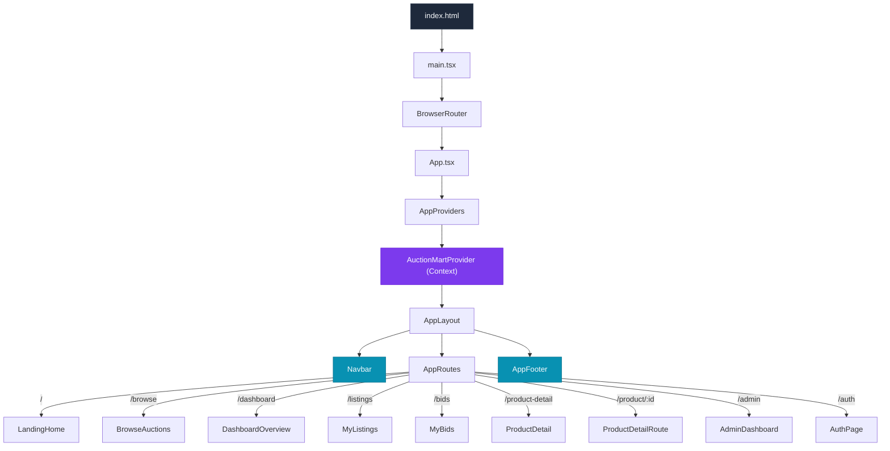

<div align="center">

# 🔨 AuctionMart

## 🎯 Overview

AuctionMart is a full-featured online auction platform where users can browse, bid on, and list luxury items across categories like watches, automobiles, collectibles, and tech. The application supports two roles — **Client** (bidder/seller) and **Admin** (moderator) — with a clean separation of concerns via a modular, layered frontend architecture and an Express + SQLite backend API.

---

## ✨ Features

| Area | Capabilities |
|---|---|
| **Auction Browsing** | Category filtering, full-text search, live countdown timers, favorites/watchlist |
| **Bidding System** | Place bids, set max (proxy) bids, bid increase, bidding war simulation |
| **Listings Management** | Create new auction listings, view your active/draft/ended listings |
| **Product Detail** | Image gallery, seller info, bid history, condition & SKU details |
| **Dashboard & Analytics** | Activity feed (bids placed, auctions won/lost, payments), auction stats |
| **Notifications** | In-app notification dropdown with unread count |
| **Admin Panel** | Flag/unflag auctions, modify user status (Verified / Standard / Flagged) |
| **Auth** | Sign-in / Sign-up page with role-based access |
| **UI/UX** | Responsive design, page transitions, skeleton loading states, empty states |

---

## 🛠 Tech Stack

### Frontend

| Technology | Purpose |
|---|---|
| **React 19** | Component-based UI library |
| **TypeScript 5.8** | Static type safety across the codebase |
| **Vite 6** | Lightning-fast dev server & build tooling |
| **Tailwind CSS 4** | Utility-first styling via `@tailwindcss/vite` plugin |
| **React Router DOM 7** | Client-side routing with `BrowserRouter` |
| **Motion (Framer Motion)** | Smooth page transitions & micro-animations |
| **Lucide React** | Consistent icon library |
| **Inter + JetBrains Mono** | Typography (Google Fonts) |

### Backend

| Technology | Purpose |
|---|---|
| **Express 5** | REST API server |
| **SQLite 3** | Lightweight relational database (`auction.db`) |
| **CORS** | Cross-origin resource sharing middleware |

---

## 🏗 Architecture

AuctionMart follows a **modular layered architecture** that separates the application into distinct, self-contained feature modules with shared cross-cutting concerns.

```
┌────────────────────────────────────────────────────────────────────┐
│                        Entry Point                                 │
│                  index.html → main.tsx → App.tsx                    │
└────────────────────────┬───────────────────────────────────────────┘
                         │
                         ▼
┌────────────────────────────────────────────────────────────────────┐
│                      App Shell Layer                               │
│  ┌──────────┐  ┌──────────────┐  ┌──────────┐  ┌──────────────┐  │
│  │ Providers│  │    Layout    │  │  Routes  │  │    Store     │  │
│  │          │  │ Navbar+Footer│  │          │  │   (Context)  │  │
│  └──────────┘  └──────────────┘  └──────────┘  └──────────────┘  │
└────────────────────────┬───────────────────────────────────────────┘
                         │
                         ▼
┌────────────────────────────────────────────────────────────────────┐
│                     Feature Modules Layer                          │
│  ┌──────────┐ ┌──────┐ ┌──────┐ ┌─────────┐ ┌─────────────────┐  │
│  │ Auctions │ │ Bids │ │ Auth │ │  Admin  │ │    Analytics    │  │
│  ├──────────┤ ├──────┤ ├──────┤ ├─────────┤ ├─────────────────┤  │
│  │ Products │ │Users │ │      │ │Notific. │ │                 │  │
│  └──────────┘ └──────┘ └──────┘ └─────────┘ └─────────────────┘  │
│  Each module contains: pages/ · types/ · services/ · components/  │
│                         hooks/                                     │
└────────────────────────┬───────────────────────────────────────────┘
                         │
                         ▼
┌────────────────────────────────────────────────────────────────────┐
│                       Shared Layer                                 │
│  ┌────────────┐  ┌───────────┐  ┌───────┐  ┌───────┐  ┌───────┐  │
│  │ Components │  │ Constants │  │ Types │  │ Hooks │  │ Utils │  │
│  │ (UI+Layout)│  │(routes,   │  │       │  │       │  │       │  │
│  │            │  │categories)│  │       │  │       │  │       │  │
│  └────────────┘  └───────────┘  └───────┘  └───────┘  └───────┘  │
└────────────────────────────────────────────────────────────────────┘
                         │
                         ▼
┌────────────────────────────────────────────────────────────────────┐
│                      Backend API Layer                             │
│          Express REST API  ←→  SQLite (auction.db)                 │
│          GET/POST/DELETE  /products  /products/:id                 │
└────────────────────────────────────────────────────────────────────┘
```

### Design Principles

- **Module Isolation** — Each feature module (`auctions`, `bids`, `auth`, etc.) owns its own pages, types, services, and components. Modules never import directly from each other's internals.
- **Shared Layer** — Cross-cutting types, UI components (`Navbar`, `EmptyState`, `CategoryPills`, `LoadingSkeleton`), hooks, constants, and utilities live in `shared/` and are consumed by any module.
- **Single Store** — Global state is managed via a React Context (`AuctionMartContext`) in the app shell, exposed through the `useAuctionMart` hook. This avoids prop-drilling while keeping state centralized.
- **Route-Driven Pages** — React Router maps URL paths to module pages. The `AppRoutes` component wires store state into each page via props.

---

## 📁 Project Structure

```
AuctionMart/
├── index.html                     # HTML entry point
├── vite.config.ts                 # Vite + Tailwind + path alias config
├── tsconfig.json                  # TypeScript compiler options
├── package.json                   # Frontend dependencies & scripts
├── .env                           # Environment variables
│
├── server/                        # ── Backend API ──
│   ├── server.js                  #   Express REST server
│   ├── db.js                      #   SQLite connection & schema
│   ├── auction.db                 #   SQLite database file
│   └── package.json               #   Server dependencies
│
└── src/                           # ── Frontend Source ──
    ├── main.tsx                   # React DOM render + BrowserRouter
    ├── App.tsx                    # Root component (Providers → Layout)
    ├── index.css                  # Tailwind imports + font config
    ├── vite-plugins.d.ts          # Vite plugin type declarations
    │
    ├── app/                       # ── App Shell ──
    │   ├── providers/
    │   │   └── AppProviders.tsx    #   Wraps children in AuctionMartProvider
    │   ├── layout/
    │   │   ├── AppLayout.tsx       #   Navbar + <main> + Footer scaffold
    │   │   └── AppFooter.tsx       #   Site footer
    │   ├── routes/
    │   │   ├── AppRoutes.tsx       #   All route definitions
    │   │   └── ProductDetailRoute.tsx  # Dynamic /product/:id route
    │   └── store/
    │       ├── AuctionMartContext.tsx   # Global Context + Provider + actions
    │       └── index.ts                # Re-export barrel
    │
    ├── modules/                   # ── Feature Modules ──
    │   ├── auctions/
    │   │   ├── pages/             #   LandingHome, BrowseAuctions, MyListings
    │   │   ├── services/          #   Mock auction data
    │   │   └── types/             #   AuctionItem interface
    │   ├── auth/
    │   │   └── pages/             #   AuthPage (Sign In / Sign Up)
    │   ├── bids/
    │   │   ├── components/        #   Bid-specific UI
    │   │   └── pages/             #   MyBids
    │   ├── products/
    │   │   └── pages/             #   ProductDetail
    │   ├── analytics/
    │   │   ├── pages/             #   DashboardOverview
    │   │   ├── services/          #   Mock activity data
    │   │   └── types/             #   RecentActivity interface
    │   ├── admin/
    │   │   └── pages/             #   AdminDashboard
    │   ├── notifications/
    │   │   ├── components/        #   NotificationDropdown
    │   │   └── hooks/             #   useNotifications
    │   └── users/
    │       ├── services/          #   Mock user data
    │       └── types/             #   UserProfile, UserRole
    │
    └── shared/                    # ── Shared / Cross-Cutting ──
        ├── components/
        │   ├── layout/            #   Navbar
        │   └── ui/                #   CategoryPills, EmptyState, LoadingSkeleton
        ├── constants/             #   Route mappings, browse categories
        ├── hooks/                 #   useAuctionTimer
        ├── types/                 #   Barrel exports (ScreenId, AuctionItem, etc.)
        └── utils/                 #   formatAuctionTimer
```

---
## Wireframe diagram

1) For landing page:

-------------------------------------------------
| AuctionMart Logo                              |
-------------------------------------------------

             Access Premium Bidding Room

      Verify security keys to access auctions

-------------------------------------------------
|          [ Sign In ] [ Sign Up ]              |
-------------------------------------------------

EMAIL ADDRESS
[____________________________________]

PASSWORD / PASSKEY
[____________________________________]

-------------------------------------------------
|              LOGIN BUTTON                     |
-------------------------------------------------

2) For home page

--------------------------------------------------------------------------------
| Logo | Search Bar | Home | Auctions | Dashboard | Listings | Bids | Profile |
--------------------------------------------------------------------------------

┌──────────────────────────────────────────────────────────────────────────────┐
│                                                                              │
│  FEATURED AUCTION / HERO SECTION                                             │
│                                                                              │
│  The Modern Marketplace for Exceptional Finds                               │
│                                                                              │
│  Short Description                                                           │
│                                                                              │
│  [ Explore Live Auctions ]   [ List an Asset ]                              │
│                                                                              │
│                                           Featured Product Image             │
│                                                                              │
└──────────────────────────────────────────────────────────────────────────────┘


Quick Categories
[Rolex] [Ferrari] [Hermes] [Leica] [Speakers]


--------------------------------------------------------------------------------
|                           LIVE AUCTIONS                                      |
--------------------------------------------------------------------------------

                           ┌─────────────┐
                           │ Product Img │ 
                           │             │ 
                           │ Product     │ 
                           │ Current Bid │ 
                           │ Time Left   │ 
                           │ [Bid Now]   │ 
                           └─────────────┘ 


--------------------------------------------------------------------------------
|                     TRUST & SECURITY SECTION                                 |
--------------------------------------------------------------------------------

┌─────────────────┐ ┌─────────────────┐ ┌─────────────────┐
│ Verified Assets │ │ Bid Protection  │ │ Compliance      │
│ Description     │ │ Description     │ │ Description     │
└─────────────────┘ └─────────────────┘ └─────────────────┘


-------------------------------------------------------------------
|                         ALERTS                                  |
-------------------------------------------------------------------

          Never Miss a Heritage Auction Reset

          [ Enter Email Address ]

                  [ Join VIP List ]

--------------------------------------------------------------------------------
|                                  FOOTER                                      |
--------------------------------------------------------------------------------

3)Browse Auctions page

--------------------------------------------------------------------------------
| Logo | Search | Home | Browse Auctions | Dashboard | Profile |
--------------------------------------------------------------------------------

┌──────────────────────────────────────────────────────────────────────────────┐
│                         PREMIUM BIDDING HUB                                 │
│                                                                              │
│ [All] [Watches] [Cars] [Collectibles] [Tech]                                │
└──────────────────────────────────────────────────────────────────────────────┘


┌───────────────┐ ┌─────────────────────────────────────────────────────────┐
│               │ │                                                         │
│   FILTERS     │ │                 FEATURED AUCTION                        │
│               │ │                                                         │
│ Search        │ │   ┌───────────────────────┐                             │
│ [_______]     │ │   │                       │                             │
│               │ │   │    Product Image      │                             │
│ Min Price     │ │   │                       │                             │
│ Max Price     │ │   └───────────────────────┘                             │
│               │ │                                                         │
│ Condition     │ │   Product Name                                          │
│ □ New         │ │   Description                                           │
│ □ Used        │ │                                                         │
│               │ │   Current Bid : ₹34,250                                 │
│ [Apply]       │ │   Time Left : 5h 20m                                    │
│               │ │                                                         │
└───────────────┘ │   [Place Bid] [View Details]                            │
                  │                                                         │
                  └───────────────────────────────────────────────────────  ┘

4)dashboard wireframe

--------------------------------------------------------------------------------
| Logo | Search | Home | Auctions | Dashboard | My Listings | My Bids |
--------------------------------------------------------------------------------

User Dashboard
Welcome, User

┌───────────┐ ┌───────────┐ ┌───────────┐ ┌───────────┐
│ Total Bids│ │ Winning   │ │ Max Bid   │ │ Success % │
│     4     │ │     2     │ │ ₹75,450   │ │ 84.2%     │
└───────────┘ └───────────┘ └───────────┘ └───────────┘


┌────────────────────────────────────────────┐ ┌─────────────────────────────┐
│ RECENT BID ACTIVITY                        │ │ MEMBERSHIP / STATUS         │
│                                            │ │                             │
│ Auction 1                                  │ │ KYC Status                  │
│ Auction 2                                  │ │ Membership Type             │
│ Auction 3                                  │ │ Benefits                    │
│ Auction 4                                  │ │                             │
└────────────────────────────────────────────┘ └─────────────────────────────┘


┌────────────────────────────────────────────┐ ┌─────────────────────────────┐
│ ACTIVE AUCTIONS                            │ │ RECOMMENDED AUCTIONS        │
│                                            │ │                             │
│ Product Name                               │ │ Suggested Item 1            │
│ Current Bid                                │ │ Suggested Item 2            │
│ Status                                     │ │ Suggested Item 3            │
│ Time Remaining                             │ │                             │
│ [View Details]                             │ │ [View More]                 │
└────────────────────────────────────────────┘ └─────────────────────────────┘


--------------------------------------------------------------------------------
| Footer                                                                       |
--------------------------------------------------------------------------------

5)For admin
--------------------------
| Logo | Admin | Profile |
--------------------------

┌──────────────────────────────────────────────────────────────────────────────┐
│                      AUCTIONMART ADMIN PANEL                                │
│                                                                              │
│ Manage Users, Auctions, Reports & Platform Health                           │
└──────────────────────────────────────────────────────────────────────────────┘


┌──────────────┐ ┌──────────────┐ ┌──────────────┐ ┌──────────────┐
│ Total Users  │ │ Revenue      │ │ Live Auctions│ │ Success Rate │
└──────────────┘ └──────────────┘ └──────────────┘ └──────────────┘


┌─────────────────────────────┐ ┌─────────────────────────────────────────┐
│ FLAGGED LISTINGS            │ │ USER MANAGEMENT                         │
│                             │ │                                         │
│ Product A                   │ │ User Name | Status | Auctions | Action │
│ [Approve] [Remove]          │ │                                         │
│                             │ │ User Name | Status | Auctions | Action │
│ Product B                   │ │                                         │
│ [Approve] [Remove]          │ │ User Name | Status | Auctions | Action │
│                             │ │                                         │
└─────────────────────────────┘ └─────────────────────────────────────────┘


┌────────────────────────────────────────────────────────────────────────────┐
│ PLATFORM HEALTH REPORT                                                     │
│                                                                            │
│ Server Status                                                              │
│ Database Status                                                            │
│ API Status                                                                 │
│ Security Alerts                                                            │
└────────────────────────────────────────────────────────────────────────────┘


┌────────────────────────────────────────────────────────────────────────────┐
│ LIVE AUCTION MONITOR                                                       │
│                                                                            │
│ Auction Name                                                               │
│ Active Bidders                                                             │
│ Current Highest Bid                                                        │
│ Auction Status                                                             │
└────────────────────────────────────────────────────────────────────────────┘


--------------------------------------------------------------------------------
| Footer                                                                     |
--------------------------------------------------------------------------------
## 🔄 Application Flow



### User Journey

1. **Landing** → User arrives at the home page with featured auctions, hero section, and category highlights.
2. **Browse** → User searches/filters auctions by category, adds items to favorites.
3. **Product Detail** → User clicks an auction card to see full details, seller info, and places a bid.
4. **Dashboard** → User checks their activity feed — bids placed, auctions won/lost, payments.
5. **My Bids** → User manages active bids, increases bid amounts, removes watched items.
6. **My Listings** → User creates new auction listings and manages existing ones.
7. **Admin** → Admin role accesses moderation tools — flag auctions, manage user statuses.

---

## 🗺 Routing

| Path | Screen ID | Page Component | Description |
|---|---|---|---|
| `/` | `home` | `LandingHome` | Hero + featured auctions |
| `/browse` | `browse` | `BrowseAuctions` | Search & filter all auctions |
| `/dashboard` | `dashboard` | `DashboardOverview` | Activity feed & stats |
| `/listings` | `listings` | `MyListings` | Manage your auction listings |
| `/bids` | `bids` | `MyBids` | Track & manage your bids |
| `/product-detail` | `product-detail` | `ProductDetail` | Selected product details |
| `/product/:id` | — | `ProductDetailRoute` | Dynamic product lookup by ID |
| `/admin` | `admin` | `AdminDashboard` | Admin moderation panel |
| `/auth` | `auth` | `AuthPage` | Sign in / Sign up |
| `*` | — | `Navigate → /` | Catch-all redirect to home |

Routes are defined in `src/app/routes/AppRoutes.tsx` with bidirectional mapping between URL paths and `ScreenId` values via `shared/constants/routes.ts`.

---

## 🗃 State Management

Global state is managed through **React Context API** in `AuctionMartContext`:

```
AuctionMartContext
├── Navigation       → currentScreen, setCurrentScreen
├── Auth             → currentUser, currentRole, handleSignInSuccess
├── Auction Data     → auctions[], activities[], users[]
├── Search           → searchQuery, setSearchQuery
├── Favorites        → favorites[], toggleFavorite()
├── Product Select   → selectedProduct, setSelectedProduct
├── Bid Actions      → handlePlaceBid(), handleBidIncrease()
├── Listing Actions  → handleCreateListing()
├── Admin Actions    → handleClearFlag(), handleModifyUserStatus()
└── Simulation       → triggerBiddingWar()


