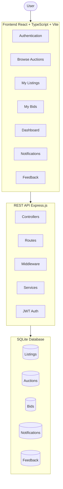
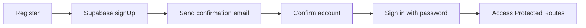
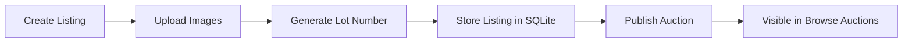
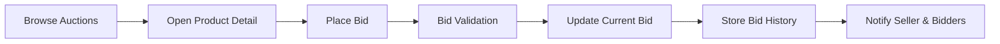
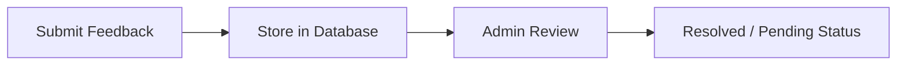

# 🏷️ AuctionMart
**A Full-Stack Online Auction Marketplace Platform**

## 📖 Project Overview

AuctionMart is a full-stack online auction platform that enables users to:
* Register and verify accounts through Supabase email confirmation
* Create auction listings
* Upload product images
* Browse active auctions
* Place bids
* Track bidding activity
* Manage personal listings
* Receive notifications
* Submit feedback
* Participate in a secure auction ecosystem

The platform combines a modern React frontend with an Express.js backend and SQLite database.

---

## 💻 Tech Stack

### Frontend
| Technology       | Purpose |
|------------      |---------|
| **React**        | Component-based UI |
| **TypeScript**   | Type Safety |
| **Vite**         | Build Tool |
| **React Router** | Client-side Routing |
| **Tailwind CSS** | Styling |
| **Lucide React** | Icons |
| **Axios**        | API Requests |

### Backend
| Technology       | Purpose |
|------------      |---------|
| **Node.js**      | Runtime Environment |
| **Express.js**   | REST API |
| **Supabase Auth**| Authentication and password recovery |
| **Multer**       | Image Uploads |
| **CORS**         | API Security |
| **dotenv**       | Environment Variables |

### Database
| Technology | Purpose |
|------------|---------|
| **SQLite** | Relational Database |
| **sqlite3**| Database Driver |
---

## ✨ Key Features

### 🔐 Authentication
* User Registration
* Login System
* Supabase Authentication
* Supabase Email Confirmation
* Supabase Password Recovery
* Protected Routes

### 🏷️ Auction System
* Browse Auctions
* Product Detail Pages
* Active Auctions
* Upcoming Auctions
* Ended Auctions
* Countdown Timers

### 📦 Listing Management
* Create Listings
* Upload Images
* Listing Preview
* Listing Filters
* My Listings Dashboard
* Listing Status Tracking

### 🔢 Lot Number System
Every auction receives a unique reference number.
**Examples:** `AM-000001`, `AM-000002`, `AM-000003`
This allows identical products to be uniquely tracked throughout the platform.

### 🔨 Bidding System
* Place Bids
* Bid Tracking
* Bid History
* Winning Bid Monitoring
* My Bids Dashboard

### 📊 Dashboard
* Statistics Cards
* User Activity Tracking
* Revenue Metrics
* Watchlist Tracking
* Recent Activity

### 💬 Feedback System
* Suggestions
* Feature Requests
* Bug Reports
* Contact Support

### 🔔 Notifications
* Auction Updates
* Activity Notifications
* Bid Alerts

---

## 🏗️ System Architecture



---

## 🔄 Flows

### Authentication Flow


### Create Listing Flow


### Bidding Flow


### Feedback Flow


---

## 📁 Project Structure

### Frontend

src/
├── app/
├── lib/
├── modules/
│   ├── auth/
│   ├── auctions/
│   ├── bids/
│   ├── dashboard/
│   ├── my-listings/
│   ├── notifications/
│   └── feedback/
├── shared/
└── services/


### Backend

Backend/
├── controllers/
├── routes/
├── middleware/
├── services/
├── database/
├── uploads/
├── server.js
└── db.js
```

---

## 🛡️ Security Features

* **Supabase Authentication:** Secure account access and session handling.
* **Email Verification:** Account confirmation through Supabase email confirmation.
* **Password Recovery:** Reset links and passkey updates through Supabase Auth.
* **Input Validation:** Thorough checking of incoming requests.
* **Protected Routes:** Both client-side and server-side route guarding.
* **Secure File Upload:** Safe image handling with Multer.

---

## 🚀 Installation & Deployment

### Frontend
1. Navigate to the root directory
2. Install dependencies:
   ```bash
   npm install
   ```
3. Start the development server:
   ```bash
   npm run dev
   ```

### Backend
1. Navigate to the `Backend` directory:
   ```bash
   cd Backend
   ```
2. Install dependencies:
   ```bash
   npm install
   ```
3. Start the server:
   ```bash
   npm start
   ```

---

## Site Link

---

## 🗺️ Future Roadmap

- Real-Time Bidding using WebSockets
- Online Payment Integration
- Seller Verification System
- AI Price Estimation
- Cloud Image Storage
- Admin Control
- Product Inquiry Chat 

---

## Author

**Raghav Khator**  
